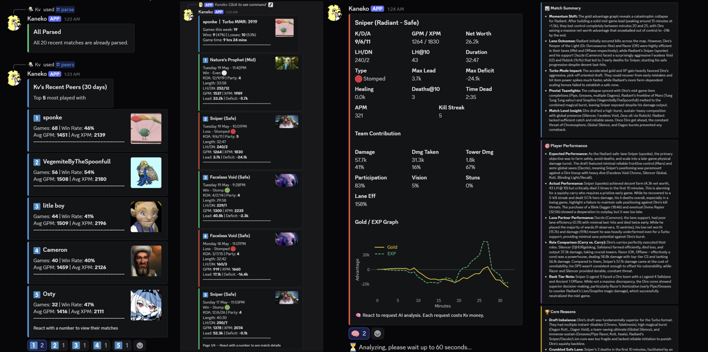

# Kaneko

[](https://www.python.org/downloads/)
[](LICENSE)

Kaneko is a Discord bot that analyzes your Dota 2 matches. It pulls data from the [OpenDota API](https://docs.opendota.com/), classifies your games, breaks down your performance, and uses an LLM to give you a detailed analysis of any match — all from within Discord.

## Features

- **Match History** — Browse your last 20 matches with win/loss, hero, K/D/A, duration, and match classification. Paginated in groups of 5 with arrow navigation
- **Match Classification** — Each game is categorized as a Stomp, Stomped, Comeback, Throw, Chaotic, or Even based on gold advantage curve analysis
- **Detailed Match Stats** — Select any match to see full stats: GPM, XPM, LH@10, Deaths@10, net worth, kill streaks, and team contribution percentages for damage, vision, stuns, tower damage, and more
- **Gold/XP Graphs** — Visualize the gold and XP advantage over the course of the match
- **AI Match Analysis** — React with the brain emoji for an LLM-powered breakdown covering match dynamics, individual performance, and the core reasons for the win or loss
- **Peer Lookup** — View your top 5 most played-with players over the last 30 days, then inspect any of their recent matches
- **Replay Parsing** — Request OpenDota to parse up to 4 unparsed replays at a time. Parsed matches unlock detailed stats, graphs, and AI analysis
- **Weekly Overview** — Win/loss record and total game time for the past 7 days
- **Per-User Rate Limiting** — Hourly limits on commands and AI analysis to prevent API abuse
- **Match Caching** — Caches parsed match data locally to minimize redundant API calls

## Screenshots



## Setup

### Prerequisites

- [uv](https://docs.astral.sh/uv/) (Python package manager)
- A Discord bot token
- An OpenRouter API key

### Installation

```sh
git clone https://github.com/Kvyii/Kaneko.git
cd Kaneko
uv sync
```

### Configuration

Copy the environment template and fill in your credentials:

```sh
cp .env.template .env
```

Open `.env` and set the following values:

| Variable | Description |
|---|---|
| `DISCORD_TOKEN` | Your Discord bot token from the [Discord Developer Portal](https://discord.com/developers/applications) |
| `OPENROUTER_API_KEY` | Your API key from [OpenRouter](https://openrouter.ai/) |
| `OPENROUTER_MODEL` | The model to use for match analysis. Defaults to `deepseek/deepseek-v4-pro` |
| `DISCORD_GUILD_IDS` | Comma-separated guild IDs for instant slash command sync. Optional — without it, commands sync globally (can take up to an hour) |

### Running the Bot

```sh
uv run dota-bot
```

## Usage

| Command | Description | API Calls |
|---|---|---|
| `/register <player_id>` | Link your Discord account to your [OpenDota](https://www.opendota.com/) player ID | 1 |
| `/matches` | Browse your last 20 matches. React with a number to view match details, then with the brain emoji for AI analysis | 7+ |
| `/peers` | See your top 5 most played-with players in the last 30 days. React to view their recent matches | 9+ |
| `/parse` | Scan your last 20 matches and request parsing for up to 4 unparsed replays (1/hour) | 21-61 |
| `/usage` | View your lifetime bot usage stats and remaining hourly rate limits | 0 |
| `/info` | Show all available commands and their API costs | 0 |

## Data

The `data/` folder contains static JSON from [odota/dotaconstants](https://github.com/odota/dotaconstants) (MIT license) for hero names, items, game modes, and rank tiers.

## License

[GPL-3.0](LICENSE)
